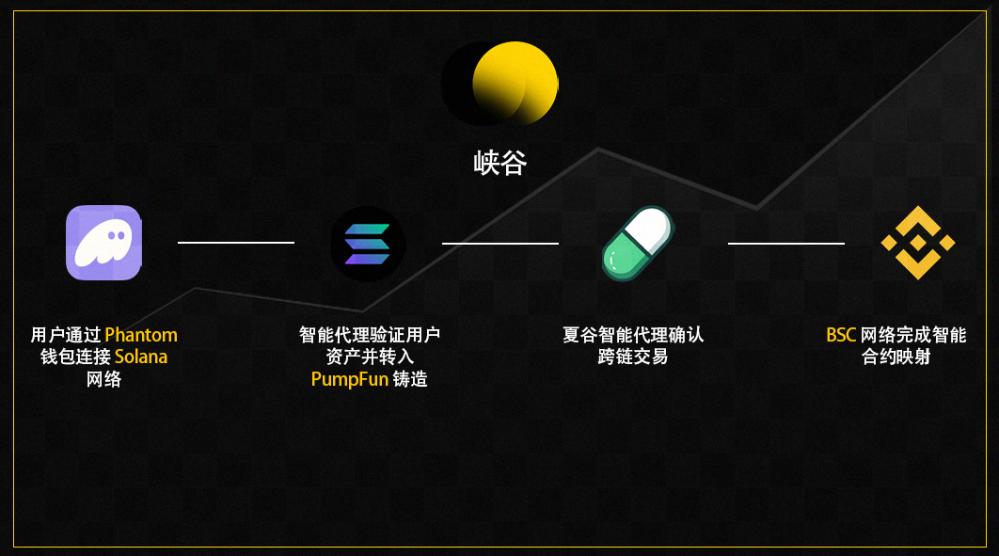

  

  <h1>峡谷</h1>
  
  

    连接 Solana 与 BSC 智能代理的跨链基础设施
  

  

    
    
    
  

  <h2>架构图</h2>
  

  <h2>目录结构</h2>

backend/
├── 合约/                    # 智能合约
├── 配置/                    # 配置文件
├── 源码/                    # 核心代码
└── 测试/                    # 测试文件

  <h2>技术栈</h2>

- Solana 程序 (Rust)
- BSC 智能合约 (Solidity)
- TypeScript
- ethers.js
- @solana/web3.js

  <h2>快速开始</h2>

环境要求:
- Node.js >= 16
- Rust >= 1.69
- Solana 命令行工具
- BSC 开发工具

安装:
git clone https://github.com/xiaguinfra/backend.git
cd backend
npm install

配置:
cp 配置/开发.json.example 配置/开发.json
cp 配置/生产.json.example 配置/生产.json

开发:
npm run dev

测试:
npm run test

部署:
npm run deploy

  <h2>链接</h2>
  
  

    
    
  

  <h2>许可证</h2>
  
  
本项目采用 MIT 许可证

  
  
版权所有 © 2024 峡谷

